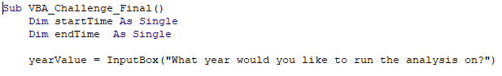
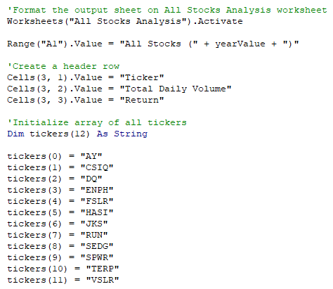
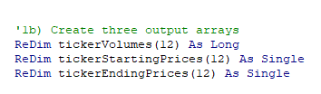
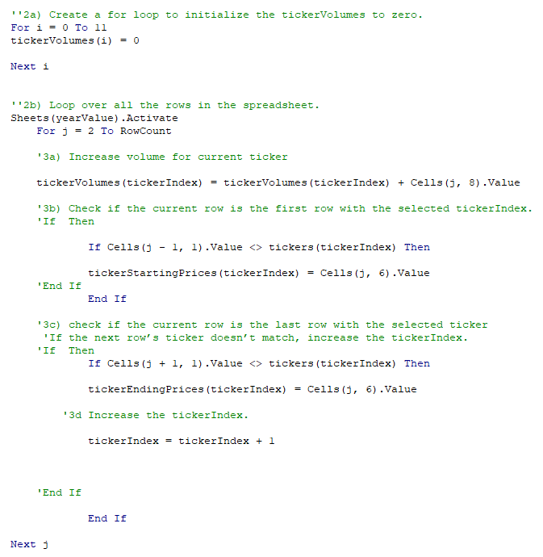
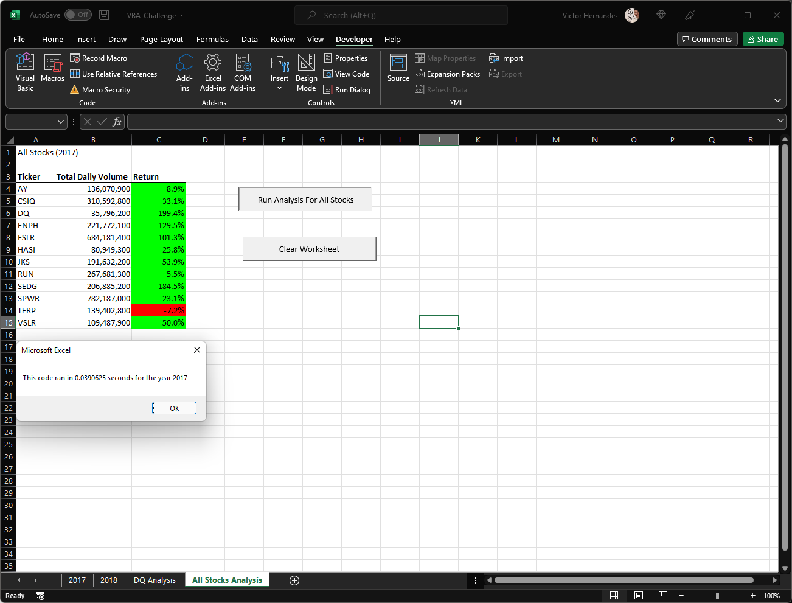
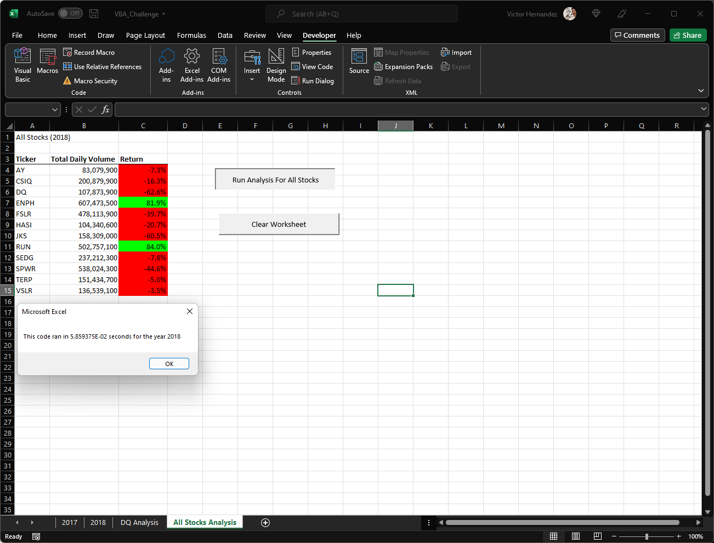

# **An Analysis for select Green Energy Stocks**

## Fit For Purpose Analysis

For this challenge the overarching goal is to help Steve identify the best investment opportunities for his parents in the green energy sector of the NYSM.  We have two years of data in a excel workbook from 2017 & 2018 with pertinent information for grouped tickers.  Steve is keying in on Total Daily Volume and Return Rate over individual years to identify the best investment opportunities.  To extract this information, we need to compile a VBA macro capable of reading through a large volume of data and compile open and close values for multiple tickers to arrive at the years return of individual stocks.

## Show Me the Returns!

To get to the results, the returns, in a timely fashion a macro able to scan by yearly ticker data was needed.  The first portions of our code meets this challenge by asking for the year to be analyzed and after receiving input from the user - timing the macros speed to finish the task.

The macros task was to compile Ticker, Total Daily Volume and Return data.  The macro needed to be guided by the user input to the year in which we needed to extract the data, then to the correct tickers.

Creating output arrays with the correct data-type was key to a successful macro.  Using the ReDim keyword the arrays were created.

As important was letting the macro know how many rows of data to loop through and that our starting point for volume was at 0.  The macro looked for the first row of the tickers data then jumped to the last row of the tickers data to compile the data and give us the total daily volume and specific year return on investment per share.

To have the top and bottom stocks stand out for Steve, the code formatted the data so that the positive results would have a green interior cell:
Year 2017:

Year 2018:

2017 was a bullish year for growth in green energy followed by a bear year in 2018 with a couple of well performing outliers within the tickers analyzed.  This data will be of value before trades are made.

## Refactoring

To get to finished product, the final macro - different iterations of the code was repurposed to fit the new objectives as the analysis went deeper into the data.  This Refactoring of code is highly advantageous by giving a framework to work with and building it up to fit the new purpose.  We can take previous work and open it up or dial it in to fit a new objective.  The disadvantage of the process is when the new task is changing far from the original purpose and the edits are as much work as starting at the top.
